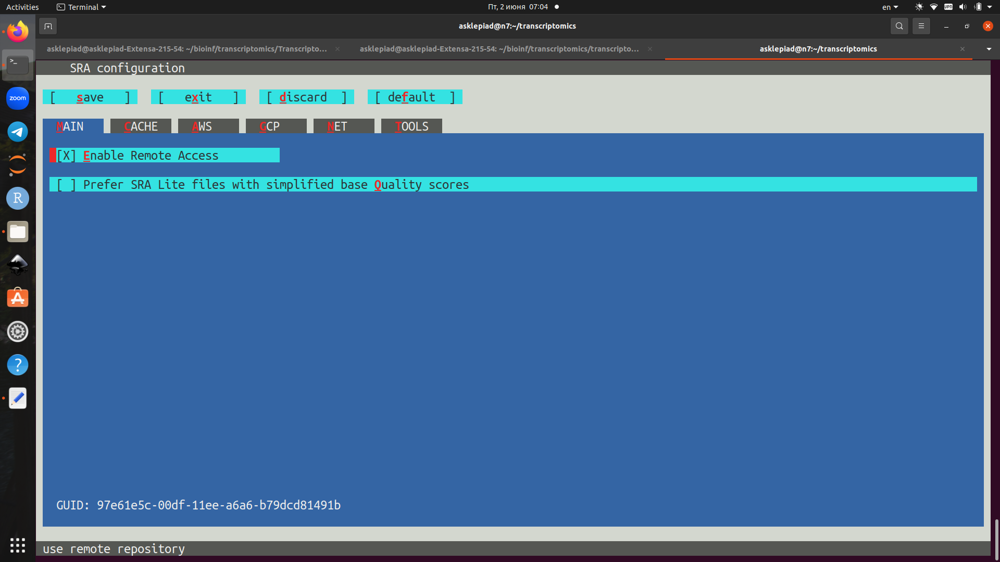
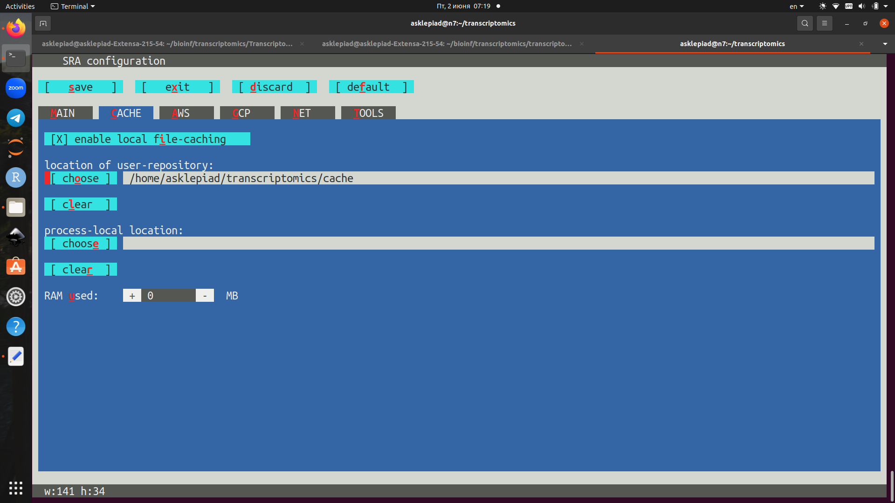
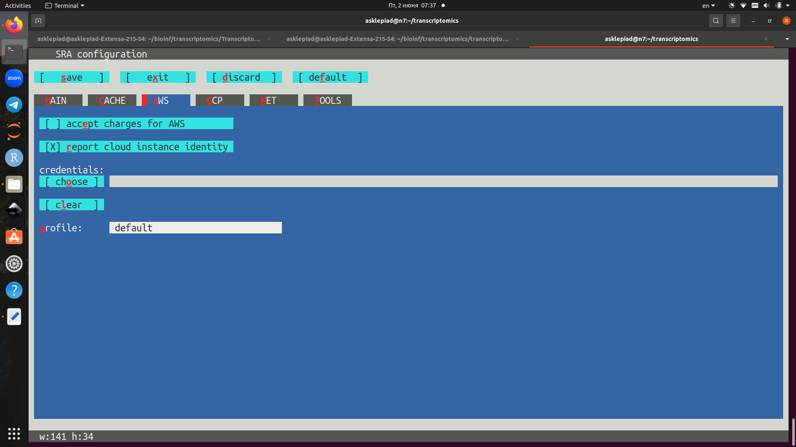
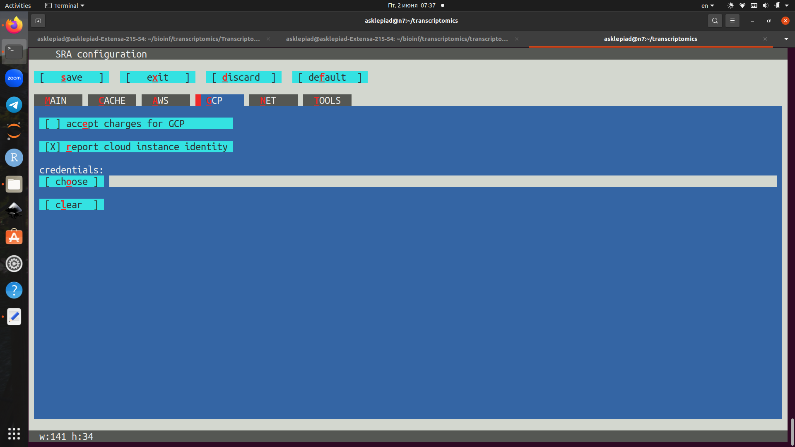
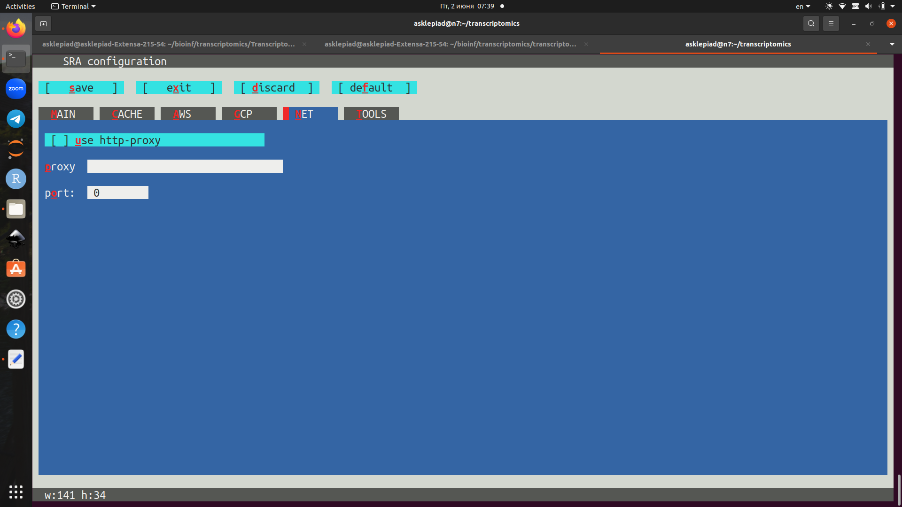
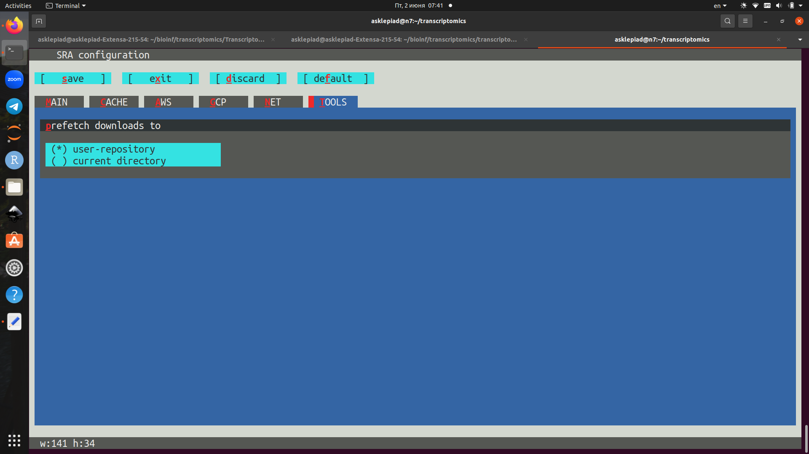

# Seminar 1

## Dependencies

## Package installing

For transcriptmics I firstly need to install SRA toolkit.
I have preinstalled conda, so I have created and activated new conda environment:

```{bash}
conda create -n sra_tools python=3.9
conda activate sra_tools
```
On the next stafe I have installed SRA toolkit by conda.

```{bash}
conda install -c bioconda sra-tools==3.0.5
```

Then I need to install fastqc and multiqc.

```{bash}
conda create -n qc python=3.9
conda activate qc
conda install -c bioconda fastqc=0.11.8
conda install -c bioconda multiqc=1.14
```


Finally I have installed nextflow.

```{bash}
conda create -n nf python=3.9
conda activate nf
conda install -c bioconda nextflow=23.04.1
```


## SRA toolkit configuring

Firstly I have created new subfolder in my transcriptomics folder:

```
mkdir transcriptomics
cd transcriptomics
mkdir cache
```

For starting configuration setting I runned the below-written command:

```{bash}
~/anaconda3/envs/sra_tools/bin/vdb-config -i
```

For configuring I used [appropriate GitHub page of SRA toolkit documentation](https://github.com/ncbi/sra-tools/wiki/05.-Toolkit-Configuration). I have chosen the following settings.

1. *Main:* Enable remote access 
2. *Cache:* I choose `cache ` directory as a place of user repository. I have chosen 0 RAM for default settings in SRA toolkit. I am planning some benchmark tests in the future.  
3. *AWS:* Report cloud instance identity 
4. *GCP:* Report cloud instance identity 
5. *Proxy:* No configures enabled 
6. *Tools:* User-repository (for more convinient accessing to downloaded SRA) 

## First pipeline creation

Objectives:

- Download two sra files from [article](https://www.nature.com/articles/s41598-018-23226-4)
- Quality analysis of them

Pipeline have been created using nextflow. The code of pipeline is in `pipeline_download_sra.nf`. 
